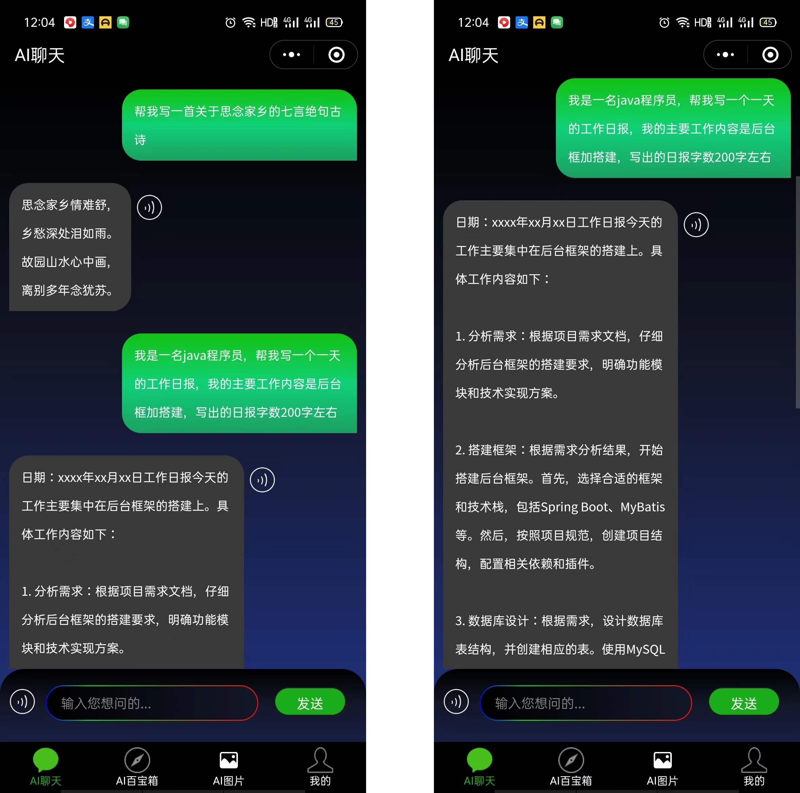
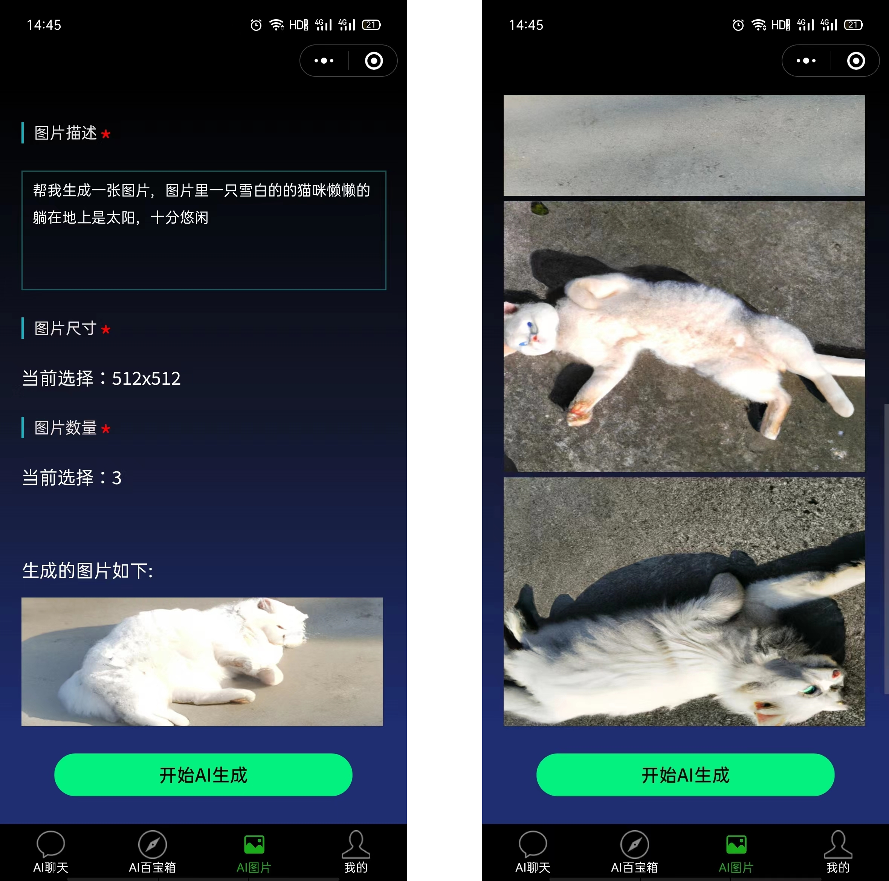
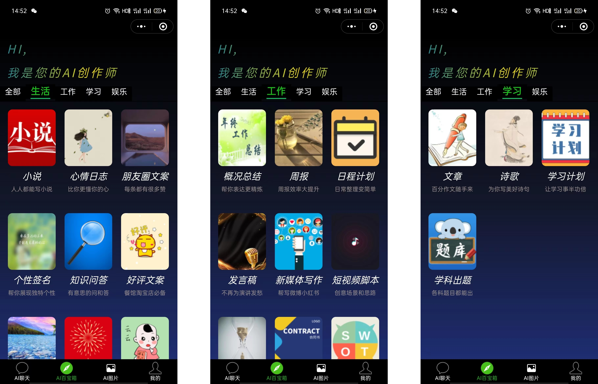
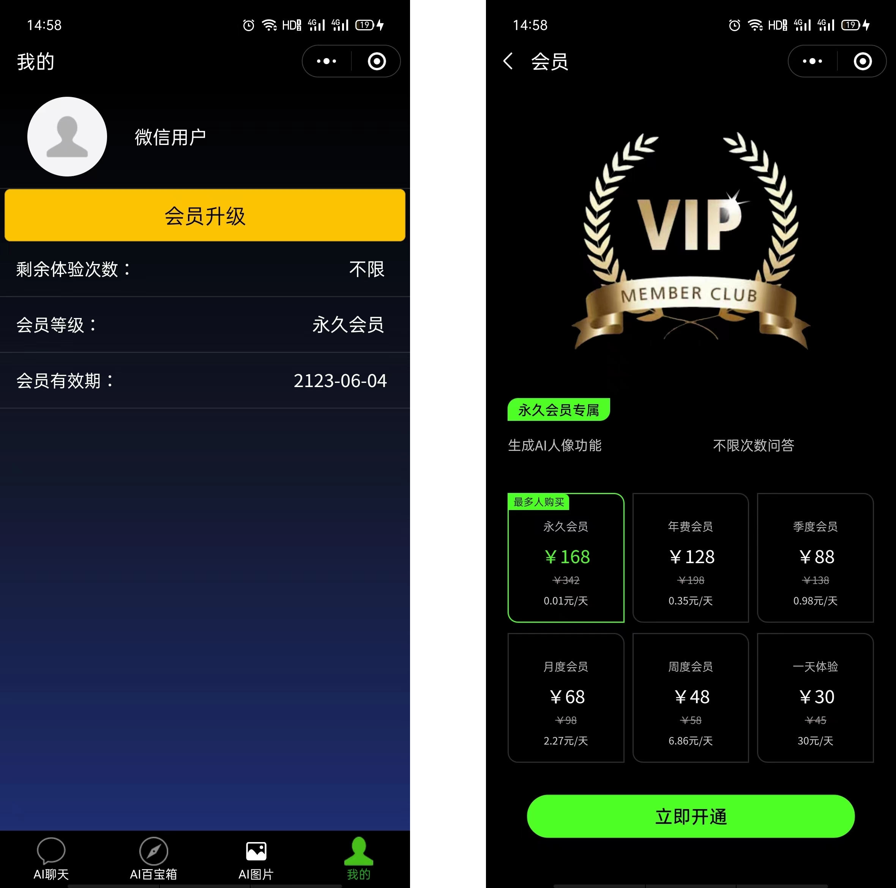
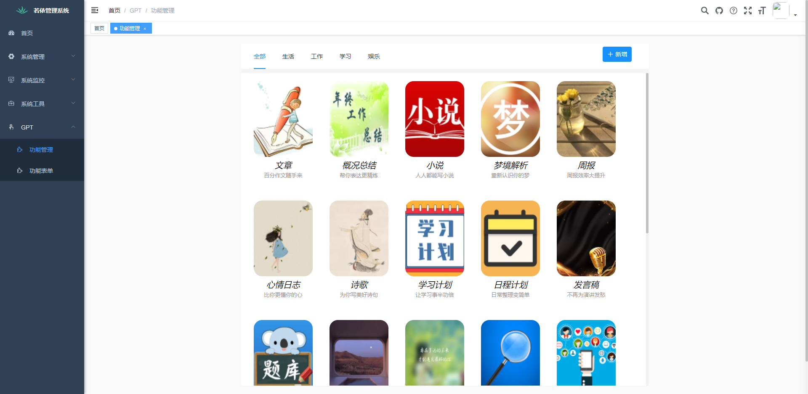

# 微信小程序 - chatgpt 智能AI
# 版权所有
江苏永信信息技术有限公司 
# 小程序简介
小程序使用原生微信小程序语言开发，后台采用springboot架构设计。小程序接入chatgpt，智能语音识别，图像识别等，微信支付等技术，包含智能AI聊天流式响应，语音识别，AI图像生成，会员管理、可以借助小程序生成 文章、古诗、论文、工作小结、日报月报、短视频脚本、各类语言程序源代码等
# 软件架构
### 微信小程序前台：
- 微信小程序原生开发 
### 后台管理前台：
- vue
### 后台：
- java
- springboot
- mysql
- 百度、腾讯、科大讯飞语音识别技术
- 微信支付
# 功能截图

 **1. 智能AI对话，模仿真人对话，您身边的专家，帮你解答各类问题 支持长按语音识别功能以及文本转语音播放功能** 

 **2. AI 设计师，说出你的需求，帮你设计图片** 

 **3. AI百宝箱-你身边的AI创作师-文章概括总结小说个性签名节日祝福发言稿短视频脚本等等** 

 **4. 会员管理** 

 **5.后台管理系统 - 百宝箱会员管理** 

# 代码开源

小程序代码 web管理端代码 后端代码 全部开源（需要的朋友可以联系我私发 13645251009、15152763704）
 注: 需要代码的朋友加我好友发送 star 点星截图

# 安装部署

1. 小程序代码直接下载到微信开发者工具即可运行

